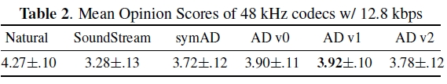
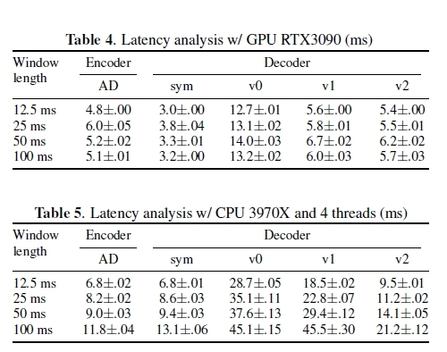

# AudioDec: An Open-source Streaming High-fidelity Neural Audio Codec
  


## Audio quality (Subjective MOS)
<p align="center">

</p>


## Latency
<p align="center">

</p>


## Model size
Only the generators.
```bash
# AutoEncoder (symAD)
# - Encoder
Number of total parmeters:3,806,368
Model size: 14.68MB
# - Decoder
Number of total parmeters:4,035,264
Model size: 15.54MB
# Vocoder (AD v0)
Number of total parmeters:12,932,610
Model size: 49.74MB
# Vocoder (AD v1)
Number of total parmeters:19,461,090
Model size: 74.90MB
# Vocoder (AD v2)
Number of total parmeters:6,927,330
Model size: 26.56MB
```
