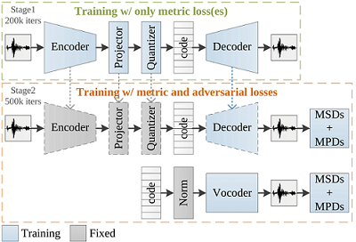

<a rel="license" href="http://creativecommons.org/licenses/by-nc/4.0/"></a> This work is licensed under a <a rel="license" href="http://creativecommons.org/licenses/by-nc/4.0/">Creative Commons Attribution-NonCommercial 4.0 International License</a>.

# AudioDec: An Open-source Streaming High-fidelity Neural Audio Codec
  
### Highlights
- Streamable high-fidelity audio codec for **48 kHz** mono speech with **12.8 kbps** bitrate.
- Very low decoding latency on **GPU (~6 ms)** and **CPU (~10 ms)** with 4 threads.
- Efficient two-stage training (with the pre-trained models, training an encoder for new applications takes only a few hours)

### Abstract
A good audio codec for live applications such as telecommunication is characterized by three key properties: (1) compression, i.e. the bitrate that is required to transmit the signal should be as low as possible; (2) latency, i.e. encoding and decoding the signal needs to be fast enough to enable communication without or with only minimal noticeable delay; and (3) reconstruction quality of the signal. In this work, we propose an open-source, streamable, and real-time neural audio codec that achieves strong performance along all three axes: it can reconstruct highly natural sounding 48 kHz speech signals while operating at only 12 kbps and running with less than 6 ms (GPU)/10 ms (CPU) latency. An efficient training paradigm is also demonstrated for developing such neural audio codecs for real-world scenarios. [[paper](https://ieeexplore.ieee.org/document/10096509)] [[demo](https://bigpon.github.io/AudioDec_demo/)]

<p align="center">

</p>

### Two modes of AudioDec
1. AutoEncoder (symmetric AudioDec, **symAD**)  
 1-1. Train an AutoEncoder-based codec model from scratch with only metric loss(es) for the first 200k iterations.  
 1-2. Fix the encoder, projector, quantizer, and codebook, and train the decoder with the discriminators for the following 500k iterations.  
2. AutoEncoder + Vocoder (**AD v0,1,2**) (recommended!)  
 2-1. Extract the stats (global mean and variance) of the codes extracted by the trained Encoder.  
 2-2. Train the vocoder with the trained Encoder and stats for 500k iterations.


## NEWS
- **2024/01/03**: Update pre-trained models ([issue9](https://github.com/facebookresearch/AudioDec/issues/9) and [issue11](https://github.com/facebookresearch/AudioDec/issues/11))
- **2023/05/17**: Upload the demo sounds on the [demo page](https://bigpon.github.io/AudioDec_demo/)
- **2023/05/13**: 1st version is released

## Requirements
This repository is tested on Ubuntu 20.04 using a V100 and the following settings.
- Python 3.8+
- Cuda 11.0+
- PyTorch 1.10+

## Folder architecture
- **bin**:
The folder of training, stats extraction, testing, and streaming templates.
- **config**:
The folder of config files (.yaml).
- **dataloader**:
The source codes of data loading.
- **exp**:
The folder for saving models.
- **layers**:
The source codes of basic neural layers.
- **losses**:
The source codes of losses.
- **models**:
The source codes of models.
- **slurmlogs**:
The folder for saving slurm logs.
- **stats**:
The folder for saving stats.
- **trainer**:
The source codes of trainers.
- **utils**:
The source codes of utils for the demo.

## Run real-time streaming encoding/decoding demo
1. Please download the whole [exp](https://github.com/facebookresearch/AudioDec/releases/download/pretrain_models_v02/exp.zip) folder and put it in the AudioDec project directory.  
2. Get the list of all I/O devices
```bash
$ python -m sounddevice
```
3. Run the demo  
```bash
# The LibriTTS model is recommended for arbitrary microphones because of the robustness of microphone channel mismatches.
# Set up the I/O devices according to the list of I/O devices

# w/ GPU
$ python demoStream.py --tx_cuda 0 --rx_cuda 0 --input_device 1 --output_device 4 --model libritts_v1

# w/ CPU
$ python demoStream.py --tx_cuda -1 --rx_cuda -1 --input_device 1 --output_device 4 --model libritts_sym

# The input and out audios will be dumped into input.wav and output.wav
```

## Run codec demo with files
1. Please download the whole [exp](https://github.com/facebookresearch/AudioDec/releases/download/pretrain_models_v02/exp.zip) folder and put it in the AudioDec project directory.  
2. Run the demo  
```bash
## VCTK 48000Hz models
$ python demoFile.py --model vctk_v1 -i xxx.wav -o ooo.wav

## LibriTTS 24000Hz model
$ python demoFile.py --model libritts_v1 -i xxx.wav -o ooo.wav
```


## Training and testing the whole AudioDec pipeline
1. Prepare the training/validation/test utterances and put them in three different folders  
   ex: **corpus/train**, **corpus/dev**, and **corpus/test**
2. Modify the paths (ex: /mnt/home/xxx/datasets) in  
   **submit_codec_vctk.sh**  
   **config/autoencoder/symAD_vctk_48000_hop300.yaml**  
   **config/statistic/symAD_vctk_48000_hop300_clean.yaml**  
   **config/vocoder/AudioDec_v1_symAD_vctk_48000_hop300_clean.yaml**
3. Assign corresponding `analyzer` and `stats` in 
   **config/statistic/symAD_vctk_48000_hop300_clean.yaml**  
   **config/vocoder/AudioDec_v1_symAD_vctk_48000_hop300_clean.yaml**
4. Follow the usage instructions in **submit_codec_vctk.sh** to run the training and testing
```bash
# stage 0: training autoencoder from scratch
# stage 1: extracting statistics
# stage 2: training vocoder from scratch
# stage 3: testing (symAE)
# stage 4: testing (AE + Vocoder)

# Run stages 0-4
$ bash submit_codec.sh --start 0 --stop 4 \
--autoencoder "autoencoder/symAD_vctk_48000_hop300" \
--statistic "stati/symAD_vctk_48000_hop300_clean" \
--vocoder "vocoder/AudioDec_v1_symAD_vctk_48000_hop300_clean"  
```


## Training and testing only the AutoEncoder
1. Prepare the training/validation/test utterances and modify the paths 
2. Follow the usage instructions in **submit_autoencoder.sh** to run the training and testing
```bash
# Train AutoEncoder from scratch
$ bash submit_autoencoder.sh --stage 0 \
--tag_name "autoencoder/symAD_vctk_48000_hop300"

# Resume AutoEncoder from previous iterations
$ bash submit_autoencoder.sh --stage 1 \
--tag_name "autoencoder/symAD_vctk_48000_hop300" \
--resumepoint 200000

# Test AutoEncoder
$ bash submit_autoencoder.sh --stage 2 \
--tag_name "autoencoder/symAD_vctk_48000_hop300"
--subset "clean_test"
```

## Pre-trained Models
All pre-trained models can be accessed via [exp](https://github.com/facebookresearch/AudioDec/releases/download/pretrain_models_v02/exp.zip) (only the generators are provided).

| AutoEncoder | Corpus | Fs | Bitrate | Path |  
|---  |---  |---  |---  |---  |
| symAD | VCTK | 48 kHz | 24 kbps | `exp/autoencoder/symAD_c16_vctk_48000_hop320`  |
| symAAD | VCTK | 48 kHz | 12.8 kbps  | `exp/autoencoder/symAAD_vctk_48000_hop300`  |
| symAD | VCTK | 48 kHz | 12.8 kbps | `exp/autoencoder/symAD_vctk_48000_hop300`  |
| symAD_univ | VCTK | 48 kHz | 12.8 kbps  | `exp/autoencoder/symADuniv_vctk_48000_hop300`  |
| symAD | LibriTTS | 24 kHz | 6.4 kbps  | `exp/autoencoder/symAD_libritts_24000_hop300`  |


| Vocoder | Corpus | Fs | Path |
|---  |---  |---  |---  |
| AD v0 | VCTK | 48 kHz | `exp/vocoder/AudioDec_v0_symAD_vctk_48000_hop300_clean` |
| AD v1 | VCTK | 48 kHz | `exp/vocoder/AudioDec_v1_symAD_vctk_48000_hop300_clean` |
| AD v2 | VCTK | 48 kHz | `exp/vocoder/AudioDec_v2_symAD_vctk_48000_hop300_clean` |
| AD_univ | VCTK | 48 kHz | `exp/vocoder/AudioDec_v3_symADuniv_vctk_48000_hop300_clean` |
| AD v1 | LibriTTS | 24 kHz | `exp/vocoder/AudioDec_v1_symAD_libritts_24000_hop300_clean` |


## Bonus Track: Denoising
1. It is easy to perform denoising by just updating the encoder using noisy-clean pairs (keeping the decoder/vocoder the same).
2. Prepare the noisy-clean corpus and follow the usage instructions in **submit_denoise.sh** to run the training and testing
```bash
# Update the Encoder for denoising
$ bash submit_autoencoder.sh --stage 0 \
--tag_name "denoise/symAD_vctk_48000_hop300"

# Denoise
$ bash submit_autoencoder.sh --stage 2 \
--encoder "denoise/symAD_vctk_48000_hop300"
--decoder "vocoder/AudioDec_v1_symAD_vctk_48000_hop300_clean"
--encoder_checkpoint 200000
--decoder_checkpoint 500000
--subset "noisy_test"

# Stream demo w/ GPU
$ python demoStream.py --tx_cuda 0 --rx_cuda 0 --input_device 1 --output_device 4 --model vctk_denoise

# Codec demo w/ files
$ python demoFile.py -i xxx.wav -o ooo.wav --model vctk_denoise

```


## Citation

If you find the code helpful, please cite the following article.

```
@INPROCEEDINGS{10096509,
  author={Wu, Yi-Chiao and Gebru, Israel D. and Marković, Dejan and Richard, Alexander},
  booktitle={ICASSP 2023 - 2023 IEEE International Conference on Acoustics, Speech and Signal Processing (ICASSP)}, 
  title={{A}udio{D}ec: An Open-Source Streaming High-Fidelity Neural Audio Codec}, 
  year={2023},
  doi={10.1109/ICASSP49357.2023.10096509}}
```

## References
The AudioDec repository is developed based on the following repositories.

- [kan-bayashi/ParallelWaveGAN](https://github.com/kan-bayashi/ParallelWaveGAN)
- [r9y9/wavenet_vocoder](https://github.com/r9y9/wavenet_vocoder)
- [jik876/hifi-gan](https://github.com/jik876/hifi-gan)
- [lucidrains/vector-quantize-pytorch](https://github.com/lucidrains/vector-quantize-pytorch)
- [chomeyama/SiFiGAN](https://github.com/chomeyama/SiFiGAN)


## License
The majority of "AudioDec: An Open-source Streaming High-fidelity Neural Audio Codec" is licensed under CC-BY-NC, however, portions of the project are available under separate license terms: https://github.com/kan-bayashi/ParallelWaveGAN, https://github.com/lucidrains/vector-quantize-pytorch, https://github.com/jik876/hifi-gan, https://github.com/r9y9/wavenet_vocoder, and https://github.com/chomeyama/SiFiGAN are licensed under the MIT license.

## FQ&A
1. **Have you compared AudioDec with Encodec?**  
 Please refer to the [discussion](https://github.com/facebookresearch/AudioDec/issues/1).
2. **Have you compared AudioDec with other non-neural-network codecs such as Opus?**  
Since this paper focuses on providing a well-developed streamable neural codec implementation with an efficient training paradigm and modularized architecture, we only compared AudioDec with SoundStream.
3. **Can you also release the pre-trained discriminators?**  
For many applications such as denoising, updating only the encoder achieves almost the same performance as updating the whole model. For applications involving decoder updating such as binaural rending, it might be better to design specific discriminators for that application. Therefore, we release only the generators.
4. **Can AudioDec encode/decode multi-channel signals?**  
Yes, you can train a MIMO model by changing the input_channels and output_channels in the config. One lesson I learned in training a MIMO model is that although the generator is MIMO, reshaping the generator output signal to mono for the following discriminator will markedly improve the MIMO audio quality.


